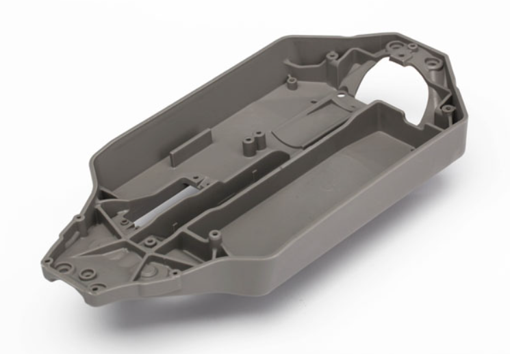
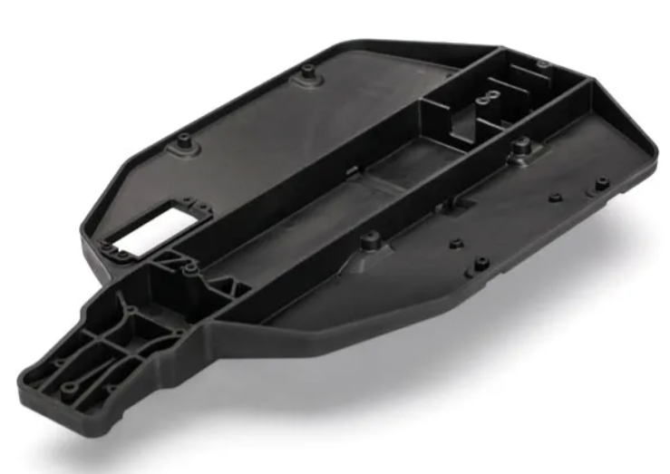

# 3D Prints

hier zie je alle finale 3D prints die gebruikt zijn geweest.

## prints
[battery case voor de headset](battery%20case%20headset%20v5.stl)

deze print is gemaakt voor op de strap van de fpv bril te gaan (past op de Walksnail Avatar HD Goggles X) deze is specifiek gemaakt voor de battrij(Tattu LiPo accupack 14.8 V 2300 mAh) en de kabels in weg te steken zodat je geen kabels zal hebben die in de weg zullen liggen/hangen waardoor je alle plaats hebt op de tafel voor het stuur te zetten en de pcb.

[camera stand voor de 4X4](CE3S1_camera%20stand%20v3.stl)

deze print is gemaakt voor de camera op de 
Chassis, Stampede 4x4 (chassis op foto hier onder) te passen voor hier dan de camera van walksnail die bij de bril hoord in de passen door de mouse die bij de auto geleverd word in het bovenste gat te steken en er dan in het midden de camera uit te snijden en dan de controller van de camera er onder te steken en deze dan vast te zetten met de klippen zowel de camera als de controller de voedings kabels van de controller worden door het gat gestoken aan de zijkant van hut stuk en op de achterkant van het stuk op de ppinnen steek je de ventilator die zal de lucht van de controller weg zuigen en naar achter blazen.

[camera stand voor de ](camera%20v20%20met%20klik%20stukken.stl)

deze print id gemaakt voor de camera op de chassis, slash (chassis op de foto hier onder) te passen voor hier dan de camera van walksnail die bij de bril hoord in de passen door de mouse die bij de auto geleverd word in het bovenste gat te steken en er dan in het midden de camera uit te snijden en dan de controller van de camera er onder te steken en deze dan vast te zetten met de klippen zowel de camera als de controller de voedings kabels van de controller worden door het gat gestoken aan de zijkant van hut stuk en op de achterkant van het stuk op de ppinnen steek je de ventilator die zal de lucht van de controller weg zuigen en naar achter blazen.

