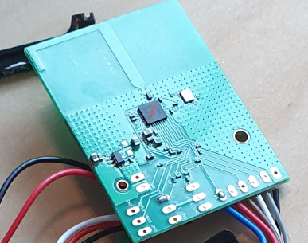
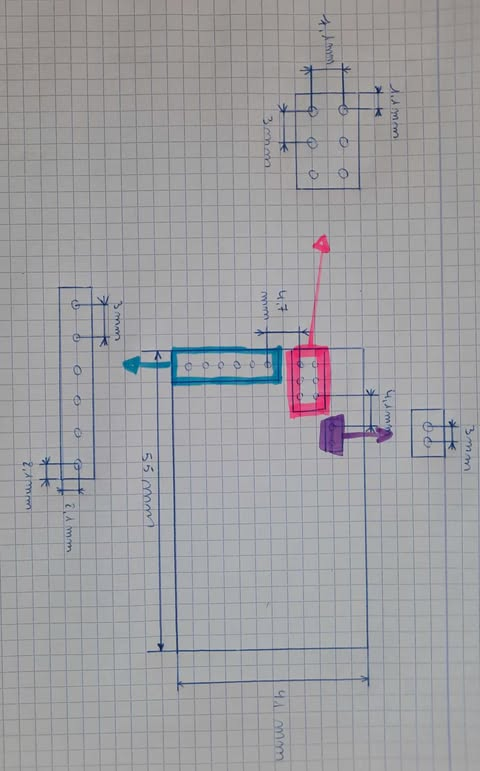
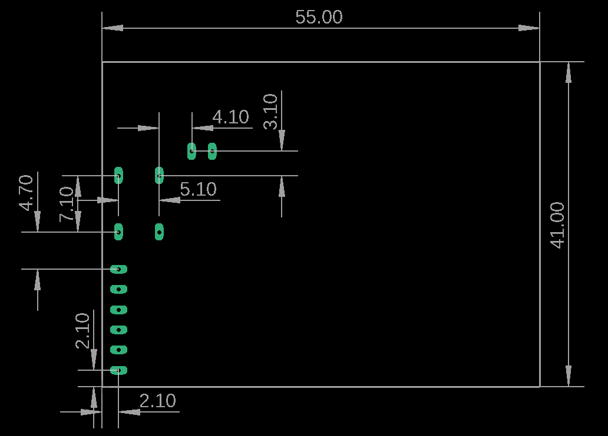
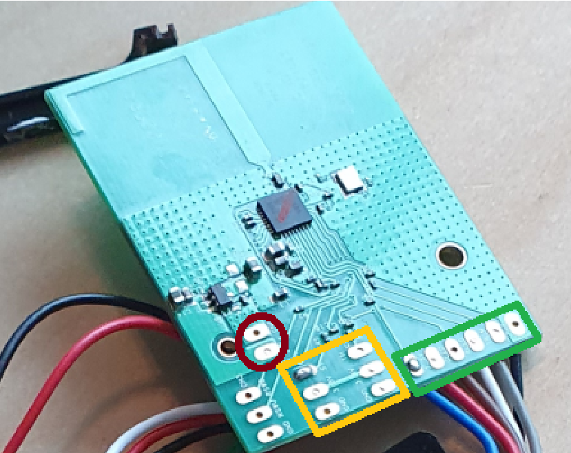
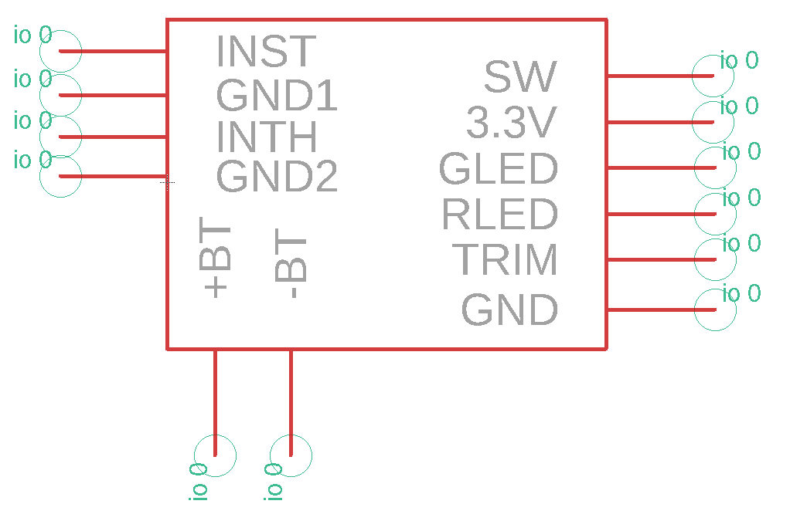
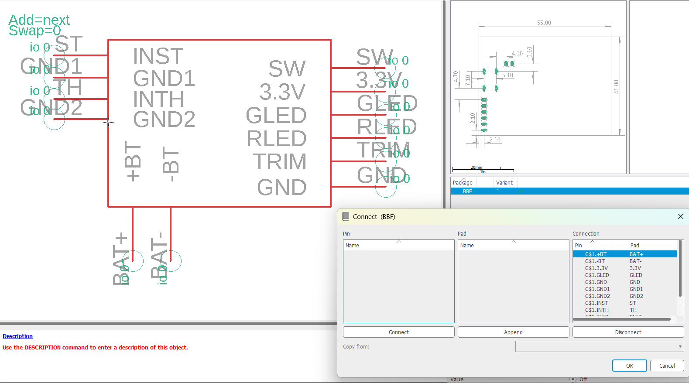
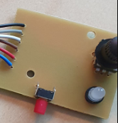
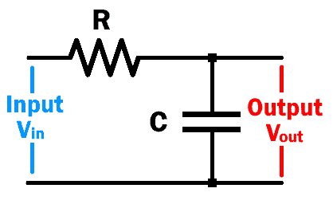
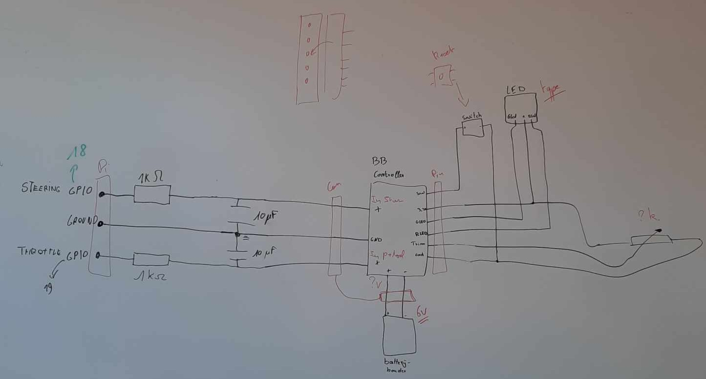

## Pcb maken 
Doelstelling: 
Alles van de besturing op 1 Pcb zetten.

Een deel van de besturing laten we gewoon zoals het is – dat stuk noemen we voortaan de "BlackBox". We zorgen ervoor dat we deze BlackBox makkelijk kunnen aansluiten op onze eigen PCB via pinheaders (male/female). Op de volgende foto zie je welk onderdeel we gebruiken als BlackBox bij het ontwerpen van deze PCB.

Voor onze PCB moeten we eerst een representatie van de BlackBox maken in EAGLE. Zo krijgen we een beter beeld van hoe we onze componenten kunnen plaatsen en waar precies, zodat alles goed past en we voldoende ruimte hebben.
Daarvoor gaan we de BlackBox opmeten en nagaan welke pinnen effectief gebruikt worden. Op die manier weten we exact welke pinheaders we in onze tekening moeten voorzien.

Met deze tekening kunnen we starten aan de footprint van de BlackBox. Ik heb de afmetingen genomen met een schuifmaat, zodat alles zo precies mogelijk klopt.

Op de volgende foto zie je de footprint die we getekend hebben, met alle nodige afmetingen. Zo kan je duidelijk zien hoe je het moet tekenen. We hebben dit volledig gebaseerd op de metingen die we vooraf genomen hebben.

Eens je een footprint hebt, moet je ook nog een bijhorend symbool maken. Het is best om hiervoor te kijken naar wat er precies op de BlackBox is aangesloten, zodat je symbool overeenkomt met de juiste pinout en functies.

De pinnen aangeduid op het **rode vlak** zijn verbonden met de batterij die op de BlackBox is aangesloten.
De pinnen met **de gele omranding** zorgen ervoor dat de auto kan sturen en vooruit of achteruit kan rijden.
De pinnen binnen **de groene omranding** worden gebruikt om het stuur nauwkeurig af te stellen, zodat de auto recht rijdt en niet uit zichzelf naar links of rechts afwijkt. Hier zitten ook de pinnen voor de resetknop, en via twee leds (groen en rood) kunnen we zien of er nog voldoende voeding is.

Het Symbol:

Zoals je kan zien, heb ik mijn symbool een beetje gebaseerd op de vorm en indeling van de BlackBox zelf. Zo is het later makkelijker om te zien waar je precies alles moet aansluiten.
Dit helpt niet alleen bij het ontwerpen, maar ook tijdens het debuggen of testen, omdat je meteen een visuele link hebt met de fysieke BlackBox.

Nu moeten we de Footprint en het Symbool nog met elkaar verbinden.

Het handigste is om de pinnen van de Footprint en die van het Symbool exact dezelfde naam te geven. Zo weet je meteen welke pinnen je met elkaar moet verbinden, zoals je ook op de afbeelding kan zien.

Eens dit gedaan is, is de BlackBox volledig klaar. We kunnen nu beginnen aan het ontwerp van de PCB zelf, waarin we later de BlackBox gaan gebruiken.

Op de PCB gaan we eerst een deel van de controller namaken, zodat we minder losse bedrading nodig hebben. Dat zorgt voor minder kans op slecht contact en maakt alles netter en betrouwbaarder.

Voor dit deel van de PCB hebben we vier nieuwe componenten nodig:

- 2x LED (groen en rood)
- 1x potentiometer (100 kΩ)
- 1x drukknop

De originele LED heeft eigenlijk drie pinnen, maar we kiezen ervoor om dit te vervangen door twee aparte LEDs. Zo brandt het groene lichtje wanneer alles normaal werkt, en schakelt de rode LED in als de batterij bijna leeg is.

Nu we weten welke componenten we nodig hebben voor dit stuk van de PCB, kunnen we verder naar het volgende onderdeel van het ontwerp.

Namelijk een **RC-Filter :**

Zoals je kan zien, maken we gebruik van twee RC-filters – eentje voor elke input. We hebben namelijk twee ingangen: eentje voor het stuur en eentje voor de pedalen.

Nu gaan we eerst op zoek naar de juiste componenten.
Ik zal deze verzamelen in een BOM-lijst (Bill of Materials), zodat we een duidelijk overzicht hebben van wat we allemaal nodig hebben.

| Component       | Naam   | Waarde  | Library (Eagle)      | Beschrijving                                |
|-----------------|--------|---------|----------------------|---------------------------------------------|
| Weerstand       | R1     | 1kΩ     | rcl (R0603)          | Gebruikt in RC-filter                       |
| Weerstand       | R2     | 1kΩ     | rcl (R0603)          | Gebruikt in RC-filter                       |
| Condensator     | C1     | 10µF    | rcl (C1210)          | Voor signaal filtering                      |
| Condensator     | C2     | 10µF    | rcl (C1210)          | Voor signaal filtering                      |
| Rode LED        | Rled   | ---     | led                  | Aantonen batterijniveau van de controller   |
| Groene LED      | Gled   | ---     | led                  | Aantonen batterijniveau van de controller   |
| Drukknop        | S1     | ---     | switch-omron         | Wordt gebruikt als reset                    |
| 40 female pins  | J1     | ---     | PPPC202LFBN-RC       | Connector met PI 5                          |
| 6 female pins   | J2     | ---     | 6 pins_target        | Connectie met de BlackBox (BB)              |
| Batterij        | BAT    | ---     | SparkFun-Connectors  | Connectie met de batterij                   |
| 3 pins stuur    | ST     | ---     | SparkFun-Connectors  | Connectie met de BlackBox (BB)              |
| 3 pins throttle | TH     | ---     | SparkFun-Connectors  | Connectie met de BlackBox (BB)              |
| Ground          | GND    | ---     | supply1              | Aarding                                     |

Nu we de BOM-lijst hebben, kunnen we beginnen met het maken van de PCB in Eagle. We starten met het tekenen van het schema en daarna gaan we verder met de layout van de PCB.

**Schema :**

Dit is het schema dat we gaan opstellen in Eagle. Voordat we beginnen, moeten we eerst goed nadenken over waar en hoe we onze componenten gaan plaatsen, zodat het schema overzichtelijk en logisch is.

Eerst gaan we via de BOM-lijst alle benodigde componenten verzamelen. Zodra we alles hebben, kunnen we starten met het maken van ons schema.

Nu we ons schema hebben opgesteld, moeten we ook de layout maken zodat we een mooie en goed werkende PCB krijgen. Hiervoor schakelen we over naar de Board-weergave in Eagle.

Alle componenten die we nodig hebben, zullen daar al staan, maar je moet ze zelf in het werkgebied slepen. Daarna kun je ze met elkaar verbinden en de juiste grootte van je PCB instellen.

Voorbeeld van een board :

Aan het voorbeeld kun je zien hoe de componenten ongeveer op het board verschijnen. Nu we dat hebben, moeten we ze op het board zelf plaatsen en ervoor zorgen dat ze dicht bij de andere componenten staan waarmee ze verbonden moeten worden.

Laten we nu aan de slag gaan met het plaatsen van de componenten voor ons eigen board.

[Board Layout](Top_Bottom_PCB.pdf)

Als we hiermee klaar zijn, is onze PCB af. Hij is nu gereed om geproduceerd te worden, en daarna moeten we zelf de componenten op de PCB solderen.