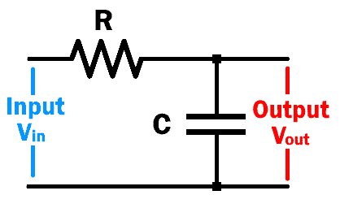
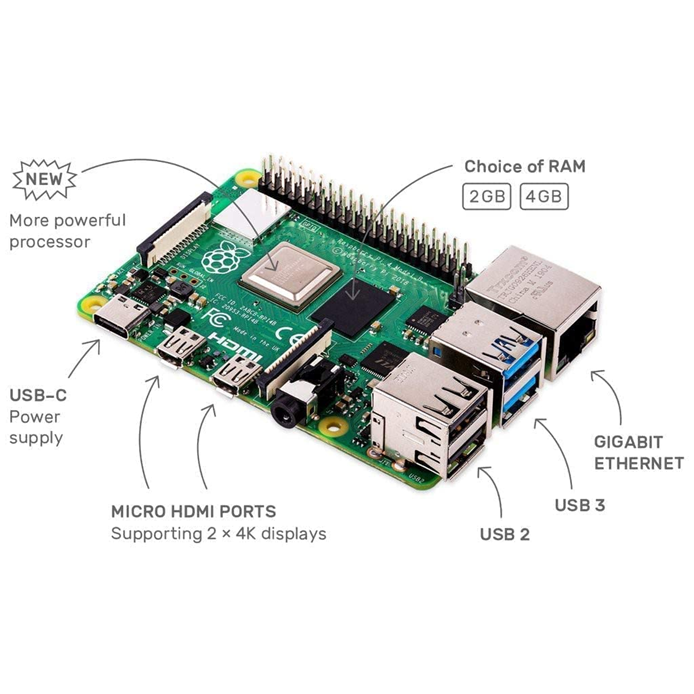
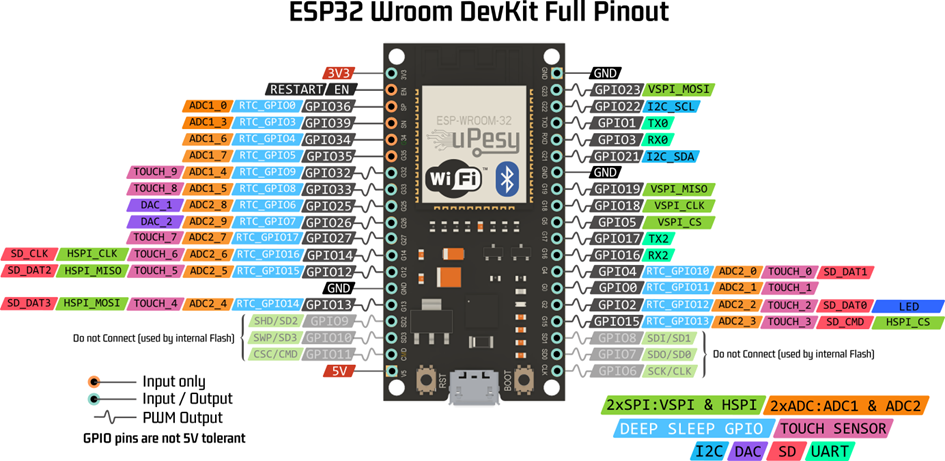

# Auto

Verbinden van een stuur en pedalen met een Raspberry Pi en het signaal uitlezen.

We zullen het stuur en de pedalen met een usb verbinden aan de raspberry pi (want er zit een usb verbinding op rapsberry pi).

Om de ingangen van het stuur en pedalen uit te lezen hebben we een softwarebibliotheek nodig die de HID-apparaten ondersteunt voor op onze raspberry pi te kunnen programmeren.
•	evdev (voor Linux HID-apparaten) eenvoudig en makkelijke implementatie
•	pygame (heeft joystick-ondersteuning)
•	hidapi (voor direct uitlezen van HID-apparaten) snelheid en efficiënt.

Wij kunnen gebruik maken van evdev en hidapi voor het uitlezen van de HID-apparaten. De pygame kunnen we ook wel gebruiken maar de joystick ondersteuning hebben we niet nodig.
We zullen de waarden van het stuur of de hoek dat we hebben moeten omzetten naar een PWM-signaal, want het zijn binaire waarden of signalen die we binnenkrijgen van het stuur en de pedalen.

Word verbonden met een antenne van de auto zelf (microcontroller).
