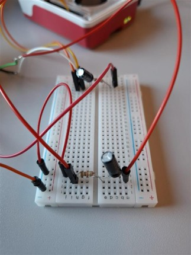

# Auto

Verbinden van een stuur en pedalen met een Raspberry Pi en het signaal uitlezen.


We zullen het stuur en de pedalen met een usb verbinden aan de raspberry pi (want er zit een usb verbinding op rapsberry pi).

Om de ingangen van het stuur en pedalen uit te lezen hebben we een softwarebibliotheek nodig die de HID-apparaten ondersteunt voor op onze raspberry pi te kunnen programmeren.
•	evdev (voor Linux HID-apparaten) eenvoudig en makkelijke implementatie
•	pygame (heeft joystick-ondersteuning)
•	hidapi (voor direct uitlezen van HID-apparaten) snelheid en efficiënt.


Wij kunnen gebruik maken van evdev en hidapi voor het uitlezen van de HID-apparaten. De pygame kunnen we ook wel gebruiken maar de joystick ondersteuning hebben we niet nodig.
We zullen de waarden van het stuur of de hoek dat we hebben moeten omzetten naar een PWM-signaal, want het zijn binaire waarden of signalen die we binnenkrijgen van het stuur en de pedalen.

Word verbonden met een antenne van de auto zelf (microcontroller).


**Hidapi (programma voor Rp4)**

HIDAPI is snel en efficiënt voor directe USB-communicatie met je Logitech stuur en pedalen op de Raspberry Pi 4.

*Stap 1:* Eerst moeten we de HIDAPI en de bijhorende dependenties installeren

```
sudo apt update

sudo apt install libhidapi-hidraw0 libhidapi-libusb0 python3-hid -y

pip install hidapi
```
Controleer als de installatie is gelukt

```
python3 -c "import hid; print(hid.enumerate())"
```
*Stap 2:* Vendor ID & Product ID van je stuur vinden

Voer de volgende code uit om de **Vendor ID en Product ID** te vinden:

```
import hid

for device in hid.enumerate():
    print(f"Vendor ID: {device['vendor_id']}, Product ID: {device['product_id']}, Product: {device['product_string']}")
```
Voor bijvoorbeeld een Logitech G29 krijg je:
```
Vendor ID: 1133, Product ID: 49743, Product: Logitech G29 Driving Force Racing Wheel
```
Deze **Vendor ID (0x046D)** en **Product ID (0xC29B)** heb je nodig om het stuur correct te openen.

*Stap 3:* Stuur & pedalen uitlezen

Hier is een voorbeeld om **de pedalen en het stuur** uit te lezen:
```
import hid
import time

# Open het Logitech stuur (pas de Vendor ID en Product ID aan indien nodig)
device = hid.device()
device.open(0x046D, 0xC29B)  # G29 (pas aan voor G920/G923)

device.set_nonblocking(True)  # Zet de verbinding op non-blocking mode

print("Logitech stuur verbonden! Druk op Ctrl+C om te stoppen.")

try:
    while True:
        report = device.read(64)  # Leest maximaal 64 bytes
        if report:
            print(report)  # Dit toont de ruwe HID-data van het stuur
        time.sleep(0.01)  # Even wachten om CPU-gebruik te beperken
except KeyboardInterrupt:
    print("\nAfsluiten...")
    device.close()
```
Hiermee kun je ruwe HID-data van het stuur en de pedalen lezen.

*Stap 4:* Data decoderen (Stuur, Pedalen)

De ruwe HID-data moet worden geïnterpreteerd. Logitech-sturen geven data in een vaste structuur terug.
Voor een G29/G920/G923, de eerste paar bytes betekenen:

•	Byte 0 = stuurpositie (0-255, of 16-bit waarde)

•	Byte 1 = gas (0-255)

•	Byte 2 = rem (0-255)

•	Byte 3 = koppeling (0-255)

**Een voorbeeld om stuur en pedalen correct uit te lezen:**
```
import hid
import time

device = hid.device()
device.open(0x046D, 0xC29B)  # Vendor en Product ID voor G29
device.set_nonblocking(True)

print("Logitech stuur verbonden! Stuur, gas, rem en koppeling worden uitgelezen.")

try:
    while True:
        report = device.read(64)
        if report:
            # Decodeer stuur en pedalen
            wheel = (report[0] | (report[1] << 8)) - 32768  # 16-bit stuurpositie
            gas = report[2]  # Gas (0-255)
            brake = report[3]  # Rem (0-255)

            print(f"Stuur: {wheel}, Gas: {gas}, Rem: {brake}, Koppeling: {clutch}")
        time.sleep(0.01)
except KeyboardInterrupt:
    print("\nAfsluiten...")
    device.close()
```

Samengevat.:
1.	Installeer HIDAPI met apt install libhidapi-libusb0 en pip install hidapi.
2.	Zoek de Vendor & Product ID van je stuur met hid.enumerate().
3.	Lees ruwe HID-data uit met device.read(64).
4.	Decodeer stuur, pedalen en knoppen voor een bruikbare output.


