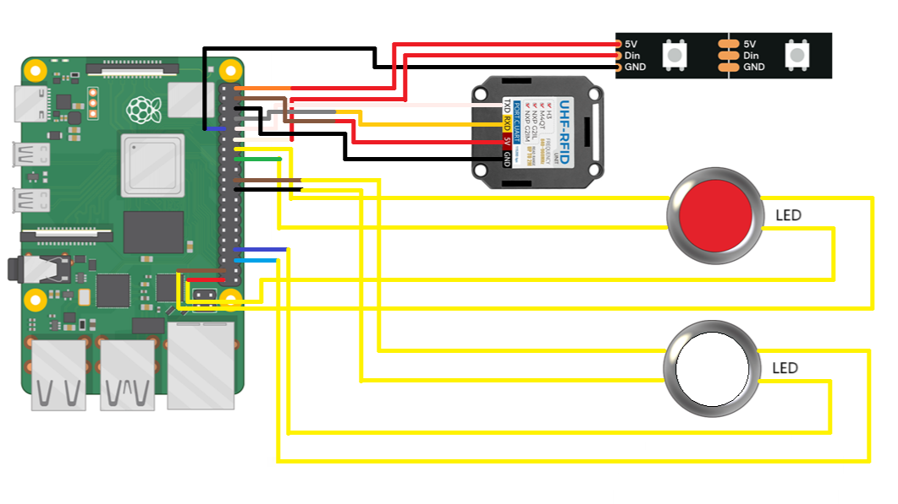

# Documentatie

Hier is de algemene documentatie waar je links hebt naar de andere readme's van onderdelen van het project, de bronnen die gebruikt zijn en de BOM.

## Inhoudstafel

- [Documentatie](#documentatie)
  - [Inhoudstafel](#inhoudstafel)
  - [Bronnen](#bronnen)
  - [BOM](#bom)
  - [BOM PCB](#bom-pcb)
  - [Architecture document](#architecture-document)

## Bronnen

- [link Raspberrypi repo ( met boeken )](https://github.com/raspberrypipress/released-pdfs/tree/main)
- [link naar de officiele documentatie van Raspberrypi](https://www.raspberrypi.com/documentation/)

## BOM

Dit zijn de componenten die we aangekocht hebben voor dit project. Deze kunnen altijd op andere websites gekocht worden.

De BOM of Bill of Materials lijst alle componenten die nodig zijn voor 2 auto's, 2 sturen en een start en finish.

| Component  | hoeveelheid | prijs/eenheid |
| :- | :-: | -: |
|[XT60-connectors](https://www.digikey.be/nl/products/detail/sparkfun-electronics/PRT-10474/8258064?gclsrc=aw.ds&&utm_adgroup=&utm_source=google&utm_medium=cpc&utm_campaign=PMax%20Shopping_Product_Medium%20ROAS&utm_term=&productid=8258064&utm_content=&utm_id=go_cmp-20165341163_adg-_ad-__dev-c_ext-_prd-8258064_sig-CjwKCAiAzba9BhBhEiwA7glbaopZ2rqK_TdDuvgb5Zz30wjMLblPNjO98bAJn2_yomfwpLOfmhfh-xoCKzQQAvD_BwE&gad_source=1&gclid=CjwKCAiAzba9BhBhEiwA7glbaopZ2rqK_TdDuvgb5Zz30wjMLblPNjO98bAJn2_yomfwpLOfmhfh-xoCKzQQAvD_BwE&gclsrc=aw.ds) | 2 | € 3.06 |
| [Bosch batterij](https://www.123accu.nl/Bosch-Starterset-2x-Bosch-GBA-12V-accu-s-lader-12V-3-0-Ah-origineel-i50227.html) | 4 | € 57.645 |
| [Bosch adapter](https://www.legerstockdeinze.be/nl/a/67516179/gaa-12v-21-adapter) | 2 | € 48.34 |
| [Lipo accupack](https://www.conrad.be/nl/p/tattu-lipo-accupack-14-8-v-2300-mah-aantal-cellen-4-75-c-block-xt60-3304647.html#attributesNotes_delivery) | 4 | € 22.1125|
| [lipo lader](https://www.conrad.be/nl/p/isdt-d-2-multifunctionele-modelbouwlader-230-v-12-a-li-poly-li-ion-lifepo-lihv-nimh-nicd-lood-1947638.html#productDownloads) | 1 | € 123.96 |
| [Raspberry pi 4](https://be.farnell.com/raspberry-pi/rpi4-modbp-4gb/raspberry-pi-4-model-b-4gb/dp/3051887) | 1 | € 51.33 |
| [RFID Tags](https://www.gotron.be/uhf-rfid-tags-zelfklevend-5pcs.html) | 2 | € 5  |
| [RFID Reader](https://www.digikey.be/nl/products/detail/m5stack-technology-co-ltd/U107/14318610?s=N4IgTCBcDaIKoAkBiACASkgkgERXAdgJYAuKAFAFJrYC0ALAAwDMArAJQogC6AvkA) | 1 | € 75.32 |
| [Ventilator](https://www.digikey.be/nl/products/detail/sunon-fans/ME45101V1-000U-A99/2815750?s=N4IgTCBcDa4KwE4C0BGOB2AHEgcgERAF0BfIA) | 1 | € 6.26  |
| [Female Connector](https://www.digikey.be/en/products/detail/sullins-connector-solutions/PPPC202LFBN-RC/810259?s=N4IgTCBcDaIAoIMJgAxgDIDEBCA5AtAEqIgC6AvkA) | 4 | € 1.98 |
| [HDMI to HDMI mini 3m](https://www.allekabels.nl/hdmikabels/1795/4388178/hdmi-mini-kabel.html) | 3 | €13.12 |
| Traxxas auto | 1 | € 370 |
| [RFID Tags](https://www.digikey.be/en/products/detail/sag/440690558-0238901/22081496) | 4 | €2.13 |

## BOM PCB

| Component  | hoeveelheid | prijs/eenheid |
| :- | :-: | -: |
| [SMD condensator](https://be.farnell.com/kemet/c1210c106m6pactu/cap-10-f-35v-20-x5r-1210/dp/2112703) | 8  | €0.49375 |
| [Potentiometer 100k Ohm](https://www.digikey.be/nl/products/detail/bourns-inc/3352T-1-104LF/1088342) | 4 | € 2.79 |
| PCB | 10 | €3 |

## Architecture document

Dit is het architectuur document.

Dit is het schema voor start-stop systeem.

Dit is schema van PCB

.png)

.png)
