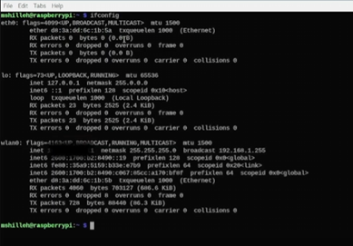
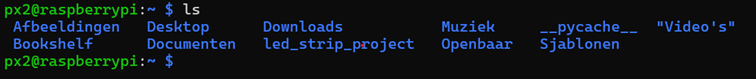
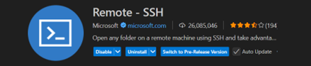
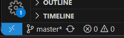
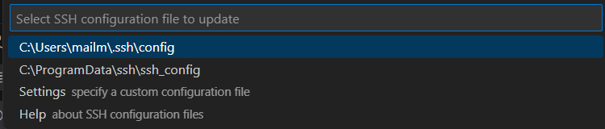

# Raspberry Pi op afstand bedienen via SSH en Visual Studio Code

Deze handleiding beschrijft hoe je je Raspberry Pi op afstand kunt bedienen via SSH en hoe je Visual Studio Code kunt gebruiken om op afstand te coderen op je Raspberry Pi.

## Stap 1: SSH inschakelen op de Raspberry Pi

1. **Open de Raspberry Pi Configuratie:**
   - Ga naar `Preferences` > `Raspberry Pi Configuration` > `Interfaces`.
   - Schakel de `SSH`-optie in.
   - Klik op `OK` en herstart de Raspberry Pi door het volgende commando in de terminal in te voeren:

     ```bash
     sudo reboot
     ```

2. **IP-adres en gebruikersnaam achterhalen:**
   - Open de terminal en voer het volgende commando uit om het IP-adres te vinden:

     ```bash
     ifconfig
     ```

     Zoek het `inet`-adres onder de `wlan0` sectie; dit is je IP-adres.
     
    

   - Voer het volgende commando uit om je gebruikersnaam te achterhalen:

     ```bash
     whoami
     ```

## Stap 2: Verbinding maken vanaf je laptop

1. **Zorg dat zowel je Raspberry Pi als je laptop met hetzelfde netwerk zijn verbonden.** Controleer de verbinding door het IP-adres van de Raspberry Pi te pingen vanaf je laptop.

2. **Maak verbinding via SSH:**
   - Open de terminal op je laptop en voer het volgende commando uit:

     ```bash
     ssh gebruikersnaam@IP-adres
     ```

     Vervang `gebruikersnaam` door je Raspberry Pi-gebruikersnaam en `IP-adres` door het IP-adres van je Raspberry Pi.

   - Je krijgt de vraag: `Are you sure you want to continue connecting (yes/no/[fingerprint])?` Typ `yes` en druk op Enter.

   - Voer je wachtwoord in wanneer daarom wordt gevraagd.

   - Nu ben je verbonden

   

3. **Als de verbinding niet lukt (bijvoorbeeld `ssh: connect to host IP-adres port 22: Connection timed out`):**
   - Start de SSH-service op de Raspberry Pi met de volgende commando's:

     ```bash
     sudo systemctl start ssh
     sudo systemctl status ssh
     ```

## Stap 3: Coderen op de Raspberry Pi met Visual Studio Code via SSH

1. **Installeer de Remote-SSH extensie:**
   - Open Visual Studio Code op je laptop.
   - Ga naar de extensies-sectie en zoek naar `Remote-SSH`.
   - Klik op `Install` om de extensie te installeren.

   

2. **Maak verbinding met de Raspberry Pi:**
   - Klik op het groene pijltje linksonder in Visual Studio Code.

   

   - Selecteer `Connect to Host...` en vervolgens `Add New SSH Host...`.
   - Voer het SSH-commando in het volgende formaat in:

     ```bash
     ssh gebruikersnaam@IP-adres
     ```

     Vervang `gebruikersnaam` door je Raspberry Pi-gebruikersnaam en `IP-adres` door het IP-adres van je Raspberry Pi.

   - Kies het configuratiebestand waarin je de SSH-configuratie wilt opslaan (meestal de bovenste optie).
   
   - Klik opnieuw op het groene pijltje linksonder en selecteer de zojuist toegevoegde host om verbinding te maken.
   - Kies het besturingssysteem van de Raspberry Pi (`Linux`) en voer je wachtwoord in wanneer daarom wordt gevraagd.

3. **Begin met coderen:**
   - Nadat de verbinding tot stand is gebracht, kun je bestanden op de Raspberry Pi openen en bewerken alsof ze lokaal zijn. Maak bijvoorbeeld een nieuwe Markdown-bestand aan om notities te maken of documentatie bij te houden.

## Conclusie

Met deze stappen kun je je Raspberry Pi op afstand bedienen via SSH en Visual Studio Code gebruiken om efficiënt te coderen zonder directe toegang tot de Raspberry Pi. Dit maakt het ontwikkelen en beheren van projecten op de Raspberry Pi een stuk flexibeler en handiger.
