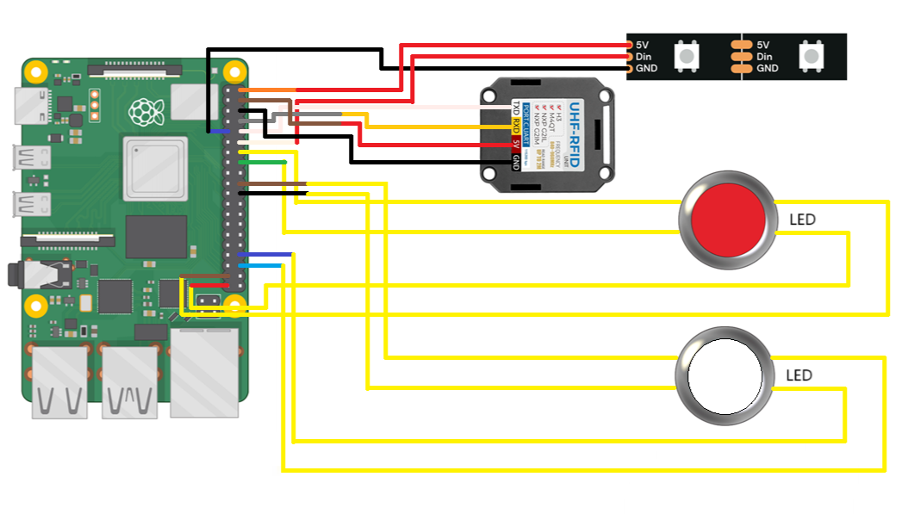

# Circuit

In deze folder bevinden zich alle bestanden voor het circuit te maken en het start-stopsysteem.

## Folder structuur

- [Code](./code/README.md): Hier bevindt zich de code voor dashboard
- [Documentatie](./documentatie/README.md): Hier bevindt zich de documentatie van ontwerp en research
- [Pi led configuraties](./pi%20led%20configuraties/README.md): Hier bevindt zich foto's en documentatie hoe alles is verbonden en werkt.
- [Render voorbeelden](./render%20voorbeelden/): Hier bevinden zich foto's van waarop we ons circuit gebaseerd hebben.
- [Schema](./schema/): Hier bevindt zich een schema van hoe alle kabels en componenten verbonden zijn voor het start-stopsysteem.

## Projectoverzicht

Het bedenken en maken van een start-finish lijn en hoe de timing en ronden bij te houden.

## Componentenlijst

Zie [BOM](../Documentatie/README.md) voor alle componenten

## Schema Diagram

Voeg het schema diagram van het circuit toe. Je kunt een afbeelding of een link naar het diagram gebruiken.

## Circuit Beschrijving

Via (RFID en 2 schermen) de tijden en ronden bijhouden, evenals het start signaal en lichten bedienen (via Raspberry Pi).
