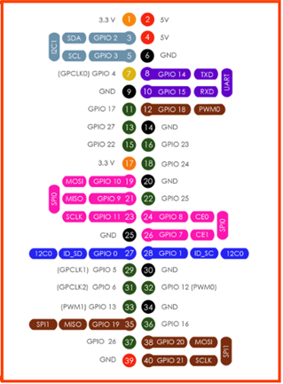

# RFID Tag Reader met JRD-4035 en Raspberry Pi

Dit project demonstreert hoe je met een Raspberry Pi en een **JRD-4035 UHF RFID-lezer** (WRL-20228) tags kunt uitlezen via de seriële poort. We gebruiken Python en het `pyserial`-pakket om de data van de lezer te interpreteren.

---

## Benodigdheden

- Raspberry Pi (getest op Raspberry Pi 4)
- JRD-4035 RFID-lezer (UHF, 840–960 MHz)
- WRL-20228 UHF RFID-tag(s)
- Jumper wires of USB-TTL converter (indien nodig)
- Python 3
- Bibliotheek: `pyserial`

---

## Installatie

### 1. Installeer Python-pakket
```bash
pip install pyserial
```

### 2. Verbind de JRD-4035 module met de UART-poort van de Piµ



- TX van de module → RX van de Pi  
- RX van de module → TX van de Pi  
- GND → GND  
- Voed de module met 3.3V of 5V (afhankelijk van je model)

**Voor Raspberry Pi 4:**

- TX: GPIO 14  
- RX: GPIO 15

### 3. Open de juiste seriële poort

Meestal is dit: `/dev/ttyS0` of `/dev/serial0`  
Controleer via:
```bash
ls /dev/tty*
```

**Gebruik ttyS0 (mini-UART):**

Schakel de seriële console uit:
```bash
sudo raspi-config
```

Ga naar:
- Interfacing Options > Serial  
- *"Would you like a login shell to be accessible over serial?"* → **Nee**  
- *"Would you like the serial port hardware to be enabled?"* → **Ja**

**Herstart daarna de Pi.**

---

## Code-uitleg

De code stuurt een `"Inventory"`-commando naar de lezer en leest de respons. We filteren het **EPC (Electronic Product Code)** van de tag uit de ruwe hex-data.

---

## Voorbeeldcode – `RFID_reader.py`

```python
import serial
import time

COM_PORT = '/dev/ttyS0'    # Gebruikte poort
BAUD_RATE = 115200         # Baudrate van de seriële console

# JRD-4035 Inventory-commando (voorbeeld - check de handleiding!)
INVENTORY_CMD = bytes.fromhex("BB 00 22 00 00 22 7E")

def parse_tag_id(data):
    """
    Voorbeeld van JRD-4035 response:
    BB 01 22 00 03 E8 00 30 00 E2 00 42 00 73 80 60 17 06 8E 04 40 D2 42 98 7E
    │   │  │  │  │  └────────────── Tag ID (12 bytes) ───────────────┘  │  │
    │   │  │  │  └─ Data Length    │                                Checksum │
    └Header ───────┘               └───────────────────────────────────────┘
    """
    if len(data) < 6 or data[0] != 0xBB or data[2] != 0x22:
        return None
    
    # Data lengte extracteren (3e byte)
    data_length = data[3]
    
    # Controleer of het pakket compleet is
    if len(data) < 5 + data_length + 2:  # Header (4) + data + checksum (2)
        return None
    
    # Tag ID extracteren (meestal 12 bytes)
    tag_start = 5  # Pas deze index aan op basis van je data!
    tag_end = tag_start + 12
    tag_bytes = data[tag_start:tag_end]
    
    return tag_bytes.hex().upper()

try:
    ser = serial.Serial(COM_PORT, BAUD_RATE, timeout=1)
    print(f"Verbonden met {COM_PORT}")

    while True:
        # Stuur inventory commando
        ser.write(INVENTORY_CMD)
        
        # Lees respons
        buffer = ser.read(ser.in_waiting or 1)
        
        if buffer:
            print("Ruwe data:", buffer.hex().upper())  # Debugging
            tag_id = parse_tag_id(buffer)
            if tag_id:
                print(f"Gedetecteerde Tag ID: {tag_id}")
        
        time.sleep(0.1)

except Exception as e:
    print(f"Fout: {e}")
finally:
    ser.close()
```

---

## Voorbeeldoutput

```
Verbonden met /dev/ttyS0  
Ruwe data: BB02220011BB3000E280699500004014CC14786227580D7E  
Gedetecteerde Tag ID: BB3000E280699500004014CC
```
