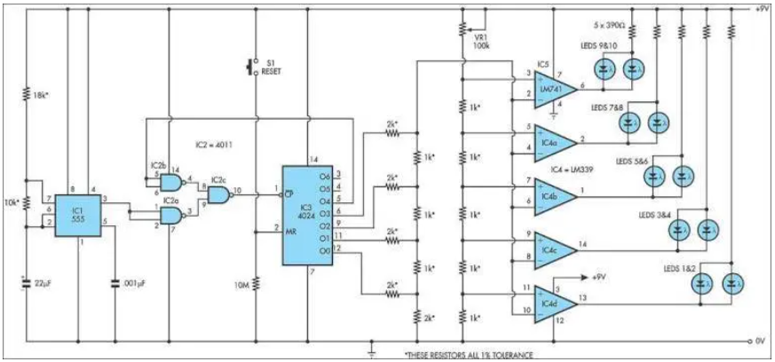

# research

## ideeën

- enkel start leds (buzzer)  --> via electronica of gebruik van controller
- matrix led's voor naam en stand (animaties) ??
- tracking van tijd (rfid?)

## analyse van hoe "start lichten" werken in de formule 1

Dit circuit reproduceert de startlichtreeks die momenteel door FISA wordt gebruikt voor Formule 1 -racen.

Het kan worden gebruikt met slot -autosets (zoals HO -schaal AFX/Life Like/Tyco -sets) of radiocontrole auto's.

IC1, een 555 timer IC, wordt gebruikt als een klokpulsgenerator.

De output wordt gevoed via NAND Gates IC2A en IC2C naar IC3, een 4024 binaire teller.

IC2B keert de O4 -uitgang van 4024 binaire teller IC3 om.

Aanvankelijk wordt IC3 gereset en zijn al zijn uitgangen laag, inclusief O4, waardoor IC2B een logische high presenteert aan de Pin 8 -ingang van IC2C die vervolgens pulsen van het 555 klokcircuit naar de klokinvoer van de 4024.

IC3 doorgeeft en vervolgens begint tellen.

Nadat de telling binaire 1111 heeft bereikt, verzendt de volgende puls de O4 -uitgang van IC3 High, die IC2C en IC3 uitschakelt, stopt met het tellen.

De vier gebruikte uitgangen van IC3 zijn verbonden met een weerstandsladder die fungeert als een eenvoudige digitale tot analoge convert-er (DAC).

Naarmate het aantal toeneemt, neemt de spanning op de bovenkant van de ladder ook toe en dit is verbonden met de inverterende ingangen van vier comparators in IC4 (een LM339) en naar IC5, een 741 OP -amp ook verbonden als vergelijker.

De positieve ingangen van de comparators zijn verbonden met de tikken van een spanningsdeler, waarbij de tikspanningen ingesteld met VR1, een 100ko -trimpot.

Aangezien IC3 telt, schakelt de stijgende stapspanning van de DAC -ladder de vergelijkers in volgorde, beginnend met IC4D en werkt tot IC5.

Terwijl elke comparator wordt ingeschakeld, wordt zijn paar LED's aangestoken; Ledt eerst 1 & 2, vervolgens LEDS 3 & 4 enzovoort.

Wanneer alle vijf paren LED's worden aangestoken, verplaatst de volgende puls van IC1 de binaire telling van IC3 naar 10000, zodat de DAC -spanningsvermogen terugvalt naar nul en alle LED's worden gedoofd.

Tegelijkertijd stopt het tellen ook, omdat de high op O4 ervoor zorgt dat IC2C verdere poortpulsen blokkeert.

Het circuit blijft vervolgens inactief totdat de teller wordt gereset door druk op drukknopschakelaar S1 te drukken. Hierdoor kan een nieuwe reeks beginnen.

Auteur: David Richards - Copyright: Silicon Chip Electronics

## controllers

men kan deze schakeling ook vereenvoudigen door microcontrollers de werking te laten emuleren (programmeren)

## voordelen

- met weinig componenten op te bouwen
- snel aanpasbaar door programmeren
- kan meerder functies combineren in 1 platform (bv timing, RFID, led sturing)
- buzzer kan apart geprogrameerd worden

## nadelen

- stroom verbruik is een groot vraagteken na wat opzoeken denk ik dat het kan maar dan moet er bijkomend electronica ter ondersteuning komen
- welk platform kiezen (pi of arduino of esp232)
- prijs

## besluit

- er dient grondig onderzocht te worden hoe en wat nodig is en wat de mogelijkheden zijn daar de timing toch een stand alone systeem moet zijn

## matrix boards

zijn als het ware "kleine tv's".

is een groep (matrix) van led's die kunnen aangestuurd worden om zo animaties en decal's te maken.

## grootes

- kan zo groot gemaakt worden als gewenst
- hangbare maten zijn:
  - 32x32
  - 64x32
  - 8x8

## comm

- werkt meestal via het i²C protocol

## analyse van tijd tracking in de racerij

### via RFID

FID-technologie (Radio Frequency Identification) kan worden gebruikt om raceauto's te volgen.

 Hier is een uitleg van hoe dit werkt en enkele overwegingen:

### hoe werkt het?

***RFID-tags:***
 Elke raceauto wordt uitgerust met een unieke RFID-tag. Deze tag bevat informatie over de auto, zoals het team, de coureur en het transpondernummer.

***RFID-lezers:***
 Op strategische locaties langs het circuit worden RFID-lezers geplaatst. Deze lezers zenden radiosignalen uit.

***Detectie:***
Wanneer een raceauto met een RFID-tag de buurt van een lezer komt, ontvangt de tag het signaal en stuurt een antwoord terug met de opgeslagen informatie.

***Dataverwerking:***
 De lezer vangt het signaal van de tag op en stuurt de informatie door naar een computersysteem. Deze informatie wordt vervolgens gebruikt om de positie van de auto op de baan te bepalen, rondetijden te registreren en andere relevante gegevens te verzamelen.

#### Voordelen van RFID-tracking in de racerij

***Nauwkeurige positionering:***
 RFID zorgt voor zeer nauwkeurige real-time tracking van de auto's op de baan.

***Automatische tijdsregistratie:***
 Het systeem registreert automatisch rondetijden en andere tijdsmetingen, waardoor menselijke fouten worden vermeden.

Verbeterde analyse: De verzamelde gegevens kunnen worden gebruikt voor gedetailleerde analyses van de race, zoals het identificeren van snelle en langzame secties van het circuit, het analyseren van inhaalmanoeuvres en het ontwikkelen van strategieën.

***Live-tracking:***
 Toeschouwers en teams kunnen de race live volgen via schermen of apps, waardoor de ervaring wordt verrijkt.

#### Overwegingen bij het implementeren van RFID-tracking

***Kosten:*** De aanschaf en installatie van RFID-apparatuur kan kostbaar zijn.

***Complexiteit:***
 Het opzetten van een betrouwbaar RFID-systeem vereist expertise en planning.

***Omgevingsfactoren:***
Factoren zoals weersomstandigheden en storingen kunnen de prestaties van het systeem beïnvloeden.

### Voorbeelden van toepassingen

***Formule 1:***
 RFID-tracking wordt al jaren gebruikt in de Formule 1 om de raceauto's te volgen en waardevolle data te verzamelen.

***Andere raceklassen:***
 Ook in andere raceklassen, zoals NASCAR en endurance-races, wordt RFID-technologie steeds vaker ingezet.

Kortom, RFID-tracking is een waardevolle technologie in de racerij die zorgt voor nauwkeurige positionering, automatische tijdsregistratie en verbeterde analyse. Het draagt bij aan een spannender en interessanter race-evenement voor zowel deelnemers als toeschouwers.

Gemini by google

## RFID

### werking

dit is een systeem die werkt met een zender die is uniek en is dus als het ware een "paspoort".

de ontvanger is het apparaat die de gegevens op de het "paspoort" leest .

dit gebeurt draadloos ( een dagelijks voorbeeld is betalen met je bankkaart of toegangs-controle).

### specs

Het bereik van RFID (Radio Frequency Identification) is afhankelijk van verschillende factoren, zoals het type RFID-tag, de frequentie, de omgeving en het type lezer. Over het algemeen kunnen we de volgende richtlijnen aanhouden:

## Type RFID-tag

### Passieve RFID-tags

Deze tags hebben geen eigen energiebron en halen hun energie uit het signaal van de lezer. Ze hebben een beperkter bereik, meestal tot enkele meters.

### Actieve RFID-tags

Deze tags hebben een eigen batterij en kunnen daardoor over grotere afstanden communiceren, tot wel 100 meter of meer.

## Frequentie

### Lage frequentie (LF)

Deze frequentie (30-300 kHz) wordt gebruikt voor toepassingen met een kort bereik, zoals toegangspassen.

### Hoge frequentie (HF)

Deze frequentie (13,56 MHz) wordt gebruikt voor toepassingen met een bereik tot ongeveer 1 meter, zoals contactloze betalingen.

### Ultra hoge frequentie (UHF)

Deze frequentie (860-960 MHz) wordt gebruikt voor toepassingen met een groter bereik, tot wel 10 meter of meer, zoals voorraadbeheer en asset tracking.

## Omgeving

### Obstakels

Metalen voorwerpen en vloeistoffen kunnen het signaal verstoren en het bereik verkleinen.

### Weersomstandigheden

Extreme temperaturen en vochtigheid kunnen de prestaties van het systeem beïnvloeden.

## Type lezer

### Zendvermogen

Lezers met een hoger zendvermogen hebben een groter bereik.

### Antenne

Het type en de kwaliteit van de antenne beïnvloeden het bereik.

## Overzicht van typische bereiken

### LF RFID

tot 10 cm

### HF RFID

Tot 1 meter

### UHF RFID (passief)

Tot 10 meter

### UHF RFID (actief)

Tot 100 meter of meer

## Factoren die het bereik kunnen beïnvloeden

### Oriëntatie van de tag en lezer

De tag en lezer moeten correct zijn georiënteerd om een goede communicatie te waarborgen.

### Interferentie

Andere elektronische apparaten kunnen het signaal verstoren.

### Kwaliteit van de componenten

Hoogwaardige tags en lezers presteren beter en hebben een groter bereik.

### Conclusie

Het bereik van RFID varieert sterk, afhankelijk van de factoren die hierboven zijn genoemd. Voor de meeste toepassingen is een bereik van enkele meters tot enkele tientallen meters voldoende.

In specifieke gevallen, zoals bij actieve RFID-tags, kunnen afstanden tot 100 meter of meer worden overbrugd.

Het is belangrijk om de juiste RFID-technologie te kiezen voor de specifieke toepassing en rekening te houden met de omgevingsfactoren die het bereik kunnen beïnvloeden.

## link naar een voorbeeld van een rfid en pi opstelling

[https://medium.com/@braden_hayes/raspberry-pi-room-controller-using-rfid-ff112f5a3fa4](https://medium.com/@braden_hayes/raspberry-pi-room-controller-using-rfid-ff112f5a3fa4)
