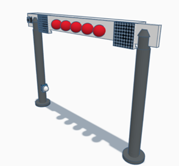
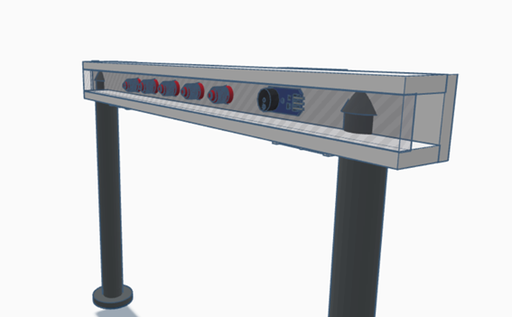
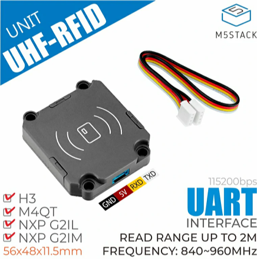

# Ontwerp Start-Finish Systeem

## Benodigdheden:
- **Twee buizen** voor de pilaren (keuze materiaal?)
- **Lange plaat** waar alles kan aan bevestigd worden (hout)
- **Piezo-sirene (12V of 24V)** – Veel luider dan een standaard buzzer en geschikt voor een race-ervaring.

- **Led strip of 5 lampen / leds**
- **Drukknop**
- **UHF RFID-lezer (860-960 MHz, UART/USB)**  
  Geschikt voor grotere afstanden (1-10 meter, afhankelijk van de antenne). Kan meerdere tags tegelijk lezen (handig als er meerdere auto's dicht bij elkaar rijden). Vereist UHF RFID-tags, die iets duurder zijn dan de standaard 13.56 MHz-tags.

  **JRD-4035 Lezermodule 840MHz ~ 960MHz (reader):**
  
  ***Product features***:  
  * Stabiele herkenningsafstand 1,5m-2m , 
  * Bereik werkspectrum: 840-960MHz ,
  * UART-communicatie-interface (baudrate: 115200bps)
  * Het buffergebied kan tot 200 tags bevatten
  * Tagherkenning is gevoelig en stabiel

  ***Pin mapping***:

  **UHF RFID Tags:**

  
  
  ***Product features***
  * Chip: Higgs-EC
  * User Memory: 128bits
  * EPC Memory: 128bit 
  * TID: 96bits 
  * Reserved 64bits  
  * Frequency 860~960MHz (UHF) 
  * Size 30*16mm 
  * Read Range 0~6m (depend on reader)
- **2 led matrixen** (hebben we)
- **Raspberry Pi** (hebben we)

