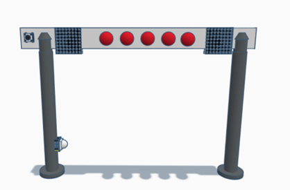
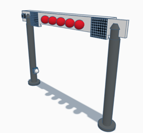
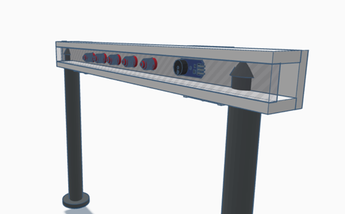

# Ontwerp Start-Finish Systeem

## Benodigdheden:
- **Twee buizen** voor de pilaren (keuze materiaal?)
- **Lange plaat** waar alles kan aan bevestigd worden (hout)
- **Piezo-sirene (12V of 24V)** – Veel luider dan een standaard buzzer en geschikt voor een race-ervaring.

- **Led strip of 5 lampen / leds**
- **Drukknop**
- **UHF RFID-lezer (860-960 MHz, UART/USB)**  
  Geschikt voor grotere afstanden (1-10 meter, afhankelijk van de antenne). Kan meerdere tags tegelijk lezen (handig als er meerdere auto's dicht bij elkaar rijden). Vereist UHF RFID-tags, die iets duurder zijn dan de standaard 13.56 MHz-tags.
- **2 led matrixen** (hebben we)
- **Raspberry Pi** (hebben we)
