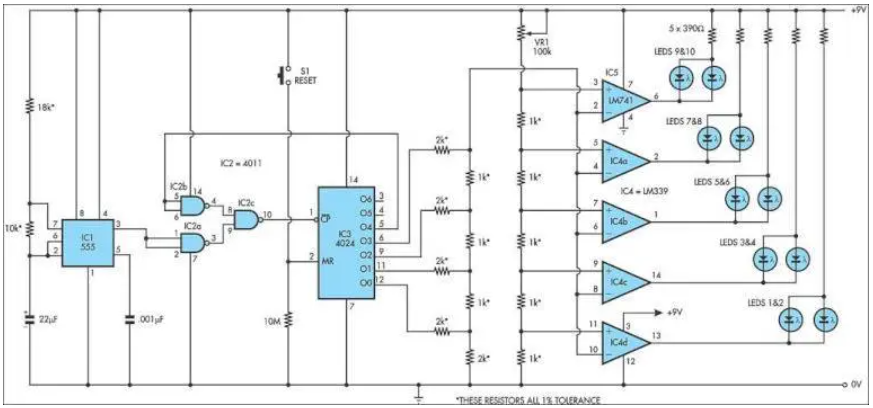

# research

## analyse van hoe "start lichten" werken in de formule 1

Dit circuit reproduceert de startlichtreeks die momenteel door FISA wordt gebruikt voor Formule 1 -racen. Het kan worden gebruikt met slot -autosets (zoals HO -schaal AFX/Life Like/Tyco -sets) of radiocontrole auto's. IC1, een 555 timer IC, wordt gebruikt als een klokpulsgenerator.

Dit circuit reproduceert de startlichtreeks die momenteel door FISA wordt gebruikt voor Formule 1 -racen. Het kan worden gebruikt met slot -autosets (zoals HO -schaal AFX/Life Like/Tyco -sets) of radiocontrole auto's. IC1, een 555 timer IC, wordt gebruikt als een klokpulsgenerator. De output wordt gevoed via NAND Gates IC2A en IC2C naar IC3, een 4024 binaire teller. IC2B keert de O4 -uitgang van 4024 binaire teller IC3 om. Aanvankelijk wordt IC3 gereset en zijn al zijn uitgangen laag, inclusief O4, waardoor IC2B een logische high presenteert aan de Pin 8 -ingang van IC2C die vervolgens pulsen van het 555 klokcircuit naar de klokinvoer van de 4024. IC3 doorgeeft en vervolgens begint tellen.

Nadat de telling binaire 1111 heeft bereikt, verzendt de volgende puls de O4 -uitgang van IC3 High, die IC2C en IC3 uitschakelt, stopt met het tellen. De vier gebruikte uitgangen van IC3 zijn verbonden met een weerstandsladder die fungeert als een eenvoudige digitale tot analoge convert-er (DAC). Naarmate het aantal toeneemt, neemt de spanning op de bovenkant van de ladder ook toe en dit is verbonden met de inverterende ingangen van vier comparators in IC4 (een LM339) en naar IC5, een 741 OP -amp ook verbonden als vergelijker.

De positieve ingangen van de comparators zijn verbonden met de tikken van een spanningsdeler, waarbij de tikspanningen ingesteld met VR1, een 100ko -trimpot. Aangezien IC3 telt, schakelt de stijgende stapspanning van de DAC -ladder de vergelijkers in volgorde, beginnend met IC4D en werkt tot IC5. Terwijl elke comparator wordt ingeschakeld, wordt zijn paar LED's aangestoken; Ledt eerst 1 & 2, vervolgens LEDS 3 & 4 enzovoort. Wanneer alle vijf paren LED's worden aangestoken, verplaatst de volgende puls van IC1 de binaire telling van IC3 naar 10000, zodat de DAC -spanningsvermogen terugvalt naar nul en alle LED's worden gedoofd. Tegelijkertijd stopt het tellen ook, omdat de high op O4 ervoor zorgt dat IC2C verdere poortpulsen blokkeert. Het circuit blijft vervolgens inactief totdat de teller wordt gereset door druk op drukknopschakelaar S1 te drukken. Hierdoor kan een nieuwe reeks beginnen.

Auteur: David Richards - Copyright: Silicon Chip Electronics