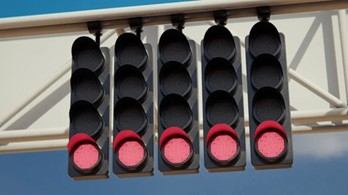
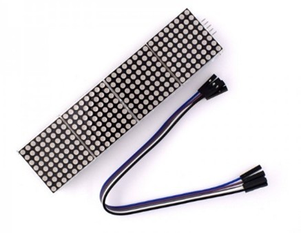
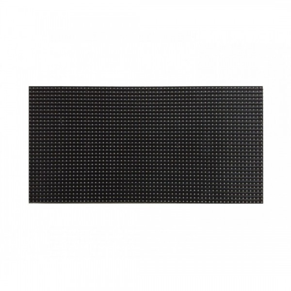
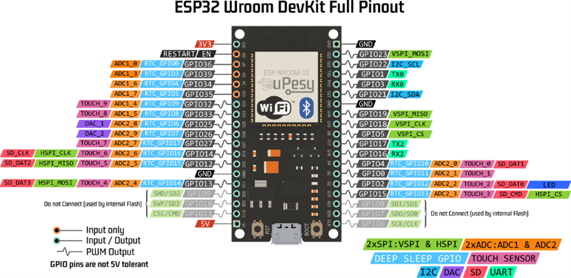

# Start/Finish Timing Systeem

## START

### Timer met lichten (F1)

De startlichten in de Formule 1 bestaan uit vijf rode lampen boven de startgrid. Ze gaan één voor één aan met korte tussenpozen. Wanneer alle vijf lichten branden, volgt een korte willekeurige pauze (tussen 0,2 en 3 seconden) voordat ze allemaal tegelijk uitgaan. Dit markeert het begin van de race. Als er een probleem is, blijven de lichten aan of gaan er oranje waarschuwingslichten branden om een valse start of uitgestelde start aan te geven.

**Video:** [YouTube](https://youtu.be/NBmQRO8_d8I)

### De lichten

- **RGB led matrix:** Cirkelvormig licht wordt geprogrammeerd op de matrixen.

- [Tinytronics RGB LED Matrix](https://www.tinytronics.nl/en/lighting/matrix)

- **3D-geprint of handgemaakt frame:** Om de lichten op te monteren.

#### Extra opties

- **Buzzer of kleine speaker:** Voor een startgeluid.
- **OLED/LCD-scherm:** Voor een countdown of meldingen.

## FINISH

### Sensor om de tijd te stoppen

#### Beste opties

1. **Lasertrip Sensor (Lasermodule + LDR/Fototransistor)**  
   - **Werking:** Een laserstraal wordt gericht op een fototransistor. Zodra de auto de straal onderbreekt, wordt de tijd gestopt.  
   - **Voordelen:** Hoge precisie en snelheid.  
   - **Nadelen:** Vereist een goed uitgelijnde laser.

2. **RFID (voor unieke detectie per auto)**  
   - **Werking:** Elke auto heeft een RFID-tag, en een RFID-lezer bij de finish detecteert wanneer de auto over de streep gaat.  
   - **Voordelen:** Herkent verschillende auto's individueel.  
   - **Nadelen:** Minder snel dan optische methoden.

## Informatie

De info die we zullen bijhouden op het einde:

1. **Tijd per auto**
2. **Welke auto wint er**
3. **Beste tijd algemeen**

Deze info kunnen we optioneel weergeven op een display aan de eindstreep.

32x16cm (19euro)

## Microcontroller

We zullen hiervoor **twee microcontrollers** nodig hebben die met elkaar moeten communiceren. Één voor de start en de andere voor de eindstreep.
ik denk dat de beste optie hiervoor een **ESP32** is (of een Rpi maar die is duurder)

