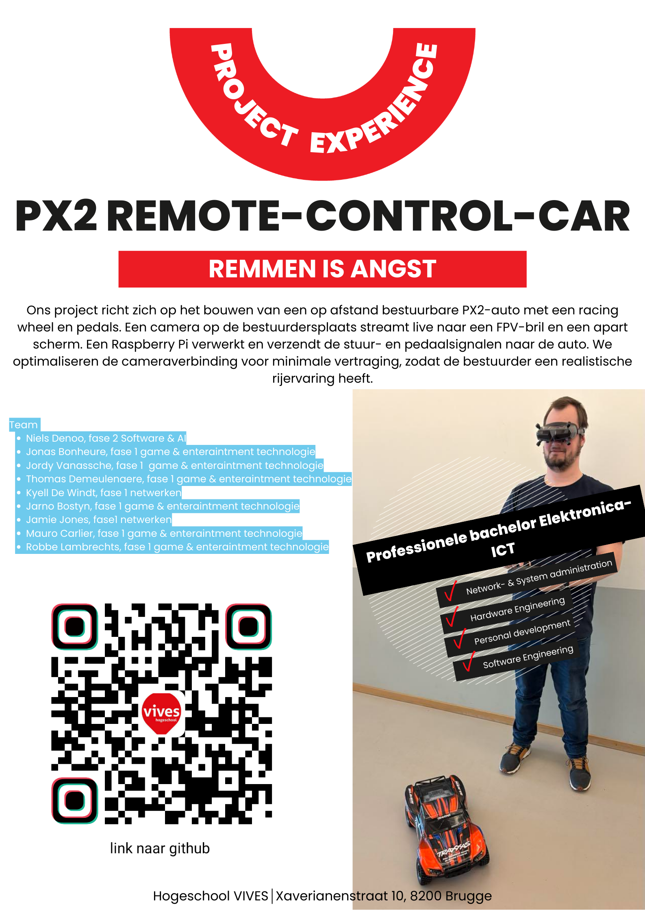

# Introductie Presentatie: RC Auto met Goggles X, Logitech Stuur en Start/Finish Lijn

## Introductie

Welkom bij onze presentatie over een innovatief RC-auto project waarin we een realistische race-ervaring nabootsen. Dit project combineert verschillende technologieën om een meeslepende en nauwkeurige besturing mogelijk te maken.

## Project Owner

Mnr. **Pedro Calleeuw**

## Scrum Master

Mnr. **Alexander D'hoore**

## team

1. **Niels Denoo**
   - Fase 2 **Software & AI**
2. **Jonas Bonheure**
   - Fase 1 **game & entertainment technologie**
3. **Jordy Vanassche**
   - Fase 1 **game & entertainment technologie**
4. **Thomas Demeulenaere**
   - Fase 1 **game & entertainment technologie**
5. **Jarno Bostyn**
   - Fase 1 **game & entertainment technologie**
6. **Mauro Carlier**
   - Fase 1 **game & entertainment technologie**
7. **Robbe Lambrechts**
   - Fase 1 **game & entertainment technologie**
8. **Jamie Jones**
   - Fase 1 **Netwerken**
9. **Kyell De Windt**
    - Fase 1 **Netwerken**

## Projectoverzicht

### Onze opzet omvat de volgende onderdelen

- **RC Auto**
  - De **auto** is uitgerust met een **besturingssysteem** dat **draadloos** signalen ontvangt en verwerkt.
&nbsp;
- **Goggles X**
  - Voor een **first-person view** (FPV) ervaring, waarmee de bestuurder zich **volledig** in de race kan **inleven.**
&nbsp;

- **Logitech Stuur**
  - Voor **realistische besturing**, waarbij het stuur en de pedalen **input** leveren aan de **auto**.
&nbsp;

- **Start/Finish Lijn**
  - Een F1-geïnspireerde **start- en finishlijn** met een **RFID-timingsysteem** voor nauwkeurige **rondetijden**.

## Doel van het project

Ons **doel** is om een **levensechte race-ervaring** te creëren waarin precisie, technologie en spanning samenkomen. Met de FPV-goggles en het stuur krijgt de gebruiker een **immersieve ervaring**, terwijl het start-/finishsysteem zorgt voor een competitief element door nauwkeurige tijdwaarneming.

In de volgende slides zullen we dieper ingaan op de technische realisatie en demonstreren hoe alles samenkomt tot een unieke RC-race-ervaring.
